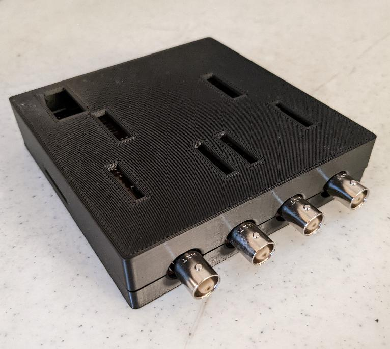

A 3d-printable case for the
[Haasoscope](https://github.com/drandyhaas/Haasoscope).

This case has a top and bottom.  The Haasoscope board should "click"
into the bottom of the case and the top can also "click on" to the
bottom.

The case has openings for both the "full speed usb port" and the usb
port of the optional "hi speed usb module".  There are also openings
for the jtag port, the "expansion pins" on both sides, the top "analog
and digital input pins", and the four sets of "gain switches".
